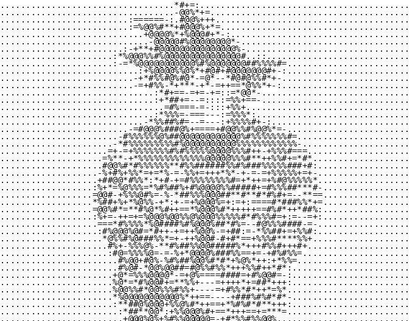
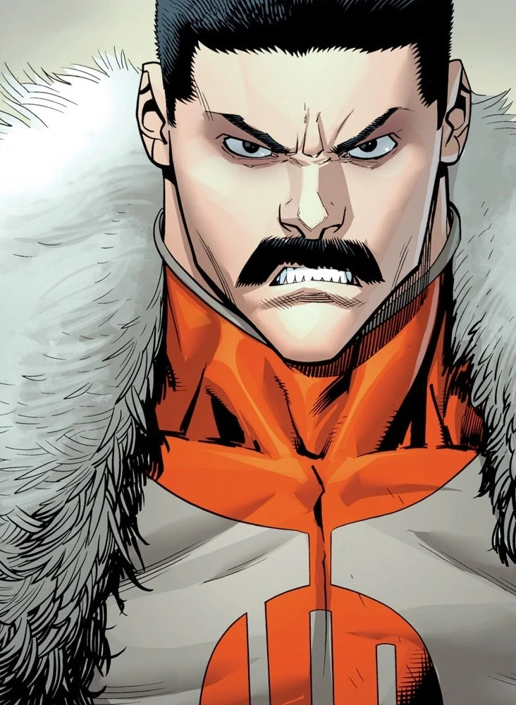
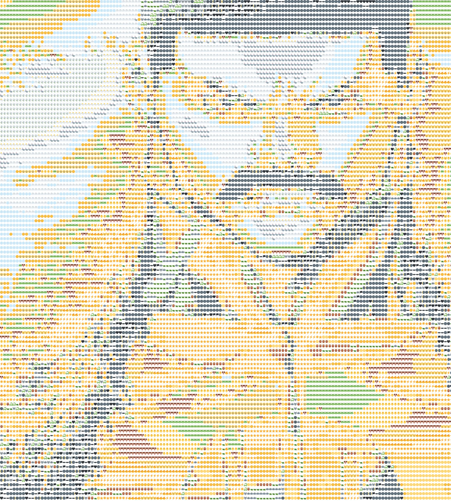
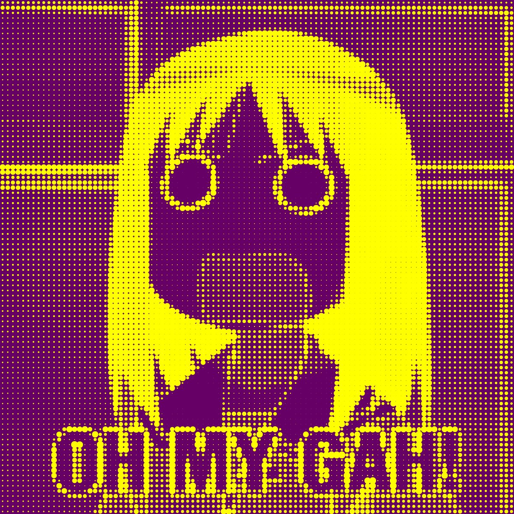

# 🎨 Imagemorpho - The Ultimate Image Morphing Bot!

## 🚀 Overview
Meet **Imagemorpho**, your friendly Discord bot that takes images and morphs them into artistic transformations! Whether you want pixel art, deep-fried memes, or glitchy chaos, Imagemorpho has you covered. Running smoothly on **AWS Lambda**, this bot processes your images in the cloud and sends back stunning transformations in seconds.

## ✨ Features
Imagemorpho offers a variety of artistic transformations:
- 🎭 **ASCII**: Convert an image into ASCII art.
- 😃 **Emoji**: Transform an image into an emoji-based mosaic.
- 🟥 **Pixel Art**: Apply a pixelation effect to the image.
- 🌫️ **Blurry**: Blur the image.
- 🍗 **Deep Fry**: Apply a deep-fried effect.
- ✏️ **Sketch**: Convert the image into a pencil sketch.
- 🎨 **Oil Paint**: Apply an oil paint effect.
- 💧 **Watercolor**: Convert the image into watercolor-style art.
- 🐱 **Cartoon**: Apply a cartoon-like appearance.
- 📺 **Glitch**: Add a glitch effect to the image.
- 💡 **Neon Glow**: Add a glowing neon effect.
- 💥 **Pop Art**: Apply a pop-art style transformation.
- 🟩 **Mosaic**: Convert the image into a mosaic-style pattern.
- 🟤 **Sepia**: Apply a sepia filter.

## 🔧 Getting Started

### 📋 Prerequisites
- Python 3.8+
- `pip` package manager
- AWS Lambda is configured for deployment (if hosting on AWS, though I recommend running it locally).
- Required dependencies installed
- Ngrok account (for local development)

### 🛠️ Installation

1. **Clone the repository** to your local machine.

2. **Install dependencies** from both `commands` and `src/app` folders:
   ```sh
   pip install -r commands/requirements.txt
   pip install -r src/app/requirements.txt

3. Set up your environment variables:
   ```sh
   export DISCORD_PUBLIC_KEY=your_public_key
   export APPLICATION_ID=your_application_id
   export DISCORD_TOKEN=your_bot_token
   ```
4 **Register the bots"" by running:
  ```sh
  python3 commands/register_commands.py
  ```

## 💻 Running Locally
1. Run the bot locally:
   ```sh
   python3 src/app/main.py
   ```

2. Create an [Ngrok](https://ngrok.com) account, download Ngrok, and authenticate your account.

3. Expose your local server to the internet using Ngrok Be sure to run this in a separate terminal window, apart from `main.py`:
   ```sh
   ngrok http 5000
   ```

4. Use the forwarding URL provided by Ngrok as your bot's endpoint URL in [Discord Developer Portal](https://discord.com/developers/applications)..

## ☁️ Deploying to AWS Lambda
Imagemorpho is designed to run on **AWS Lambda** using **Mangum** for ASGI compatibility. Deploy using AWS CDK:

### 📦 Steps:
1. Install and configure **AWS CLI**:
   ```sh
   aws configure
   ```

2. Install **AWS CDK**:
   ```sh
   npm install -g aws-cdk
   ```

3. Bootstrap your AWS environment (only needed once per AWS account):
   ```sh
   cdk bootstrap aws://YOUR_ACCOUNT_ID/YOUR_REGION
   ```

4. Deploy the application using CDK:
   ```sh
   cdk deploy
   ```
5. After deployment, **CDK will output the endpoint URL** for your deployed **API Gateway**. Use this **URL as your bot's endpoint URL** in the [Discord Developer Portal](https://discord.com/developers/applications).

## 📝 How to Use
### 📌 Commands
Imagemorpho listens to these slash commands:

#### 📗 Informational Commands
- `/intro` - Learn what Imagemorpho is and what it does.
- `/help` - Get a list of available transformations and how to use them.

#### 🖼️ Image Transformation Commands
- `/ascii` - Convert your image into ASCII art.
- `/emoji` - Transform your image into an emoji-based mosaic.
- `/pixel` - Give your image a pixelated effect.
- `/blurry` - Apply a blur effect.
- `/deep-fry` - Make your image look deep-fried.
- `/sketch` - Convert your image into a pencil sketch.
- `/oil-paint` - Apply an oil painting effect.
- `/watercolor` - Transform your image into a watercolor painting.
- `/cartoon` - Give your image a cartoonish look.
- `/glitch` - Add a digital glitch effect.
- `/neon-glow` - Make your image glow like neon lights.
- `/pop-art` - Give your image a pop-art style makeover.
- `/mosaic` - Convert your image into a mosaic pattern.
- `/sepia` - Apply a sepia-toned filter.

## 📸 Example Transformations
- Here are a few examples of what Imagemorpho can do!

### 🎭 ASCII
| **Input** | **Output** |
|-----------|-----------|
|  |  |

### 😃Emoji
| **Input** | **Output** |
|-----------|-----------|
|  |  |

### 💥Pop Art
| **Input** | **Output** |
|-----------|-----------|
|  |  |


## 🛠️ Technologies Used

- 🐍 **Python** – Backend logic and image processing  
- ⚗️ **Flask** – For handling API requests  
- 🌐 **Mangum** – ASGI compatibility for AWS Lambda  
- 🎮 **Discord API** – For bot interactions  
- 📐 **PIL, OpenCV, NumPy** – For image transformations  
- ☁️ **AWS Lambda** – Cloud hosting for serverless execution  
- 🐳 **Docker** – For containerizing the application  
- 📝 **TypeScript** – Used in bot-related scripts  
- 🏗️ **AWS CDK** – Infrastructure as code for deploying to AWS  
- 📜 **YAML** – Used for defining bot commands  


## 🤝 Contributing
Contributions are welcome! If you’d like to improve Imagemorpho or add more transformations, feel free to submit a pull request.

## 📄 License
This project is licensed under the MIT License.

